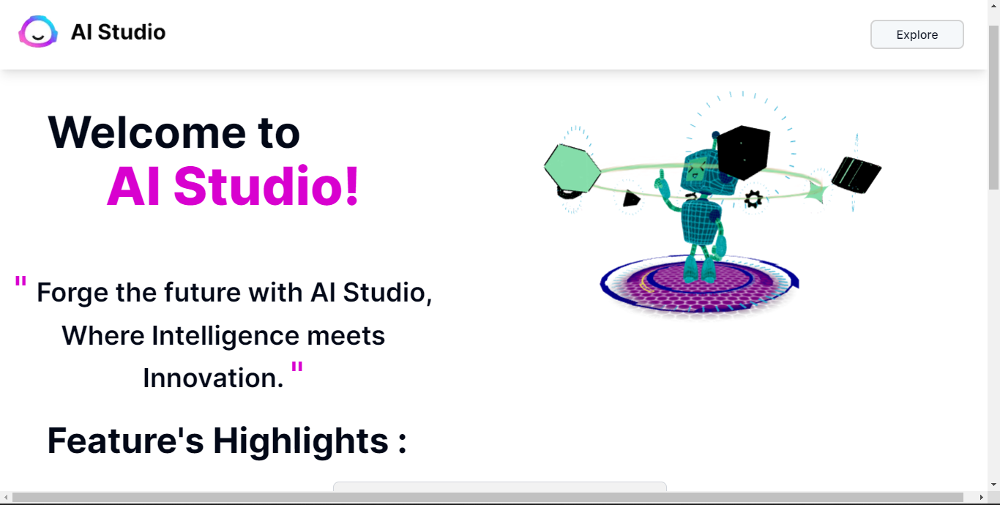
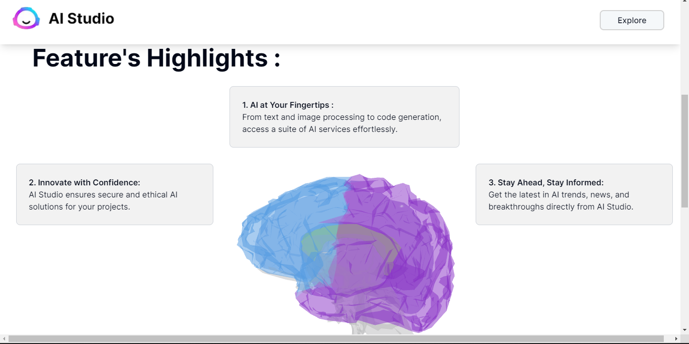
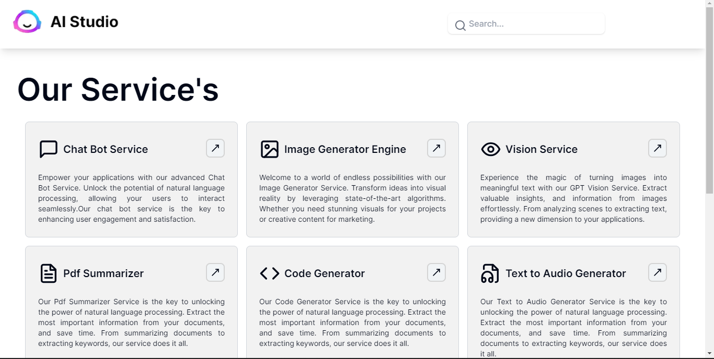

# AI Studio

Welcome to the AI Studio Hub, your go-to platform for a diverse range of artificial intelligence services. Our web application offers a multitude of functionalities, harnessing the power of cutting-edge AI models to cater to your specific needs. From natural language processing with ChatGPT to creative content generation with image, code, audio, and video services, our platform is designed to provide an all-encompassing AI experience.






## Technologies Used

🚀🎨🤖🔗🌐

The AI Studio is built using a combination of cutting-edge technologies:

🖼️ Frontend: React | Next.js | Tailwind CSS | Shadcn UI | Clerk
🎮 3D Modeling: Three.js | react-three/drei | react-three/fiber
🌐 API Integration: Axios | OpenAI
💅 Styling: Tailwind CSS | react-hot-toast | Shadcn UI
🔄 State Management: React Hook Form | Zod
🛣️ Routing: Next.js Router

## Getting Started

Follow these steps to set up the AI Studio on your local machine:

### Clone the Repository

```bash
git clone https://github.com/Prajwal-ak-0/saas.git
cd saas
npm install
npm run dev
```

# Replace these values in `.env`

```bash
NEXT_PUBLIC_CLERK_PUBLISHABLE_KEY=
CLERK_SECRET_KEY=

NEXT_PUBLIC_CLERK_SIGN_IN_URL=/sign-in
NEXT_PUBLIC_CLERK_SIGN_UP_URL=/sign-up
NEXT_PUBLIC_CLERK_AFTER_SIGN_IN_URL=/
NEXT_PUBLIC_CLERK_AFTER_SIGN_UP_URL=/

OPENAI_API_KEY=
```

**Note: This project is still under development and actively seeking contributors! If you're interested in shaping the future of AI Studio, join us in making this project better.**

Explore the possibilities with AI Studio, where innovation meets intelligence!

## Contact

If you have any questions, suggestions, or want to contribute, feel free to reach out!

- **GitHub:** [Prajwal-ak-0](https://github.com/Prajwal-ak-0)
- **LinkedIn:** [www.linkedin.com/in/prajwal-ak-802552191](https://www.linkedin.com/in/yourlinkedinprofile/)

